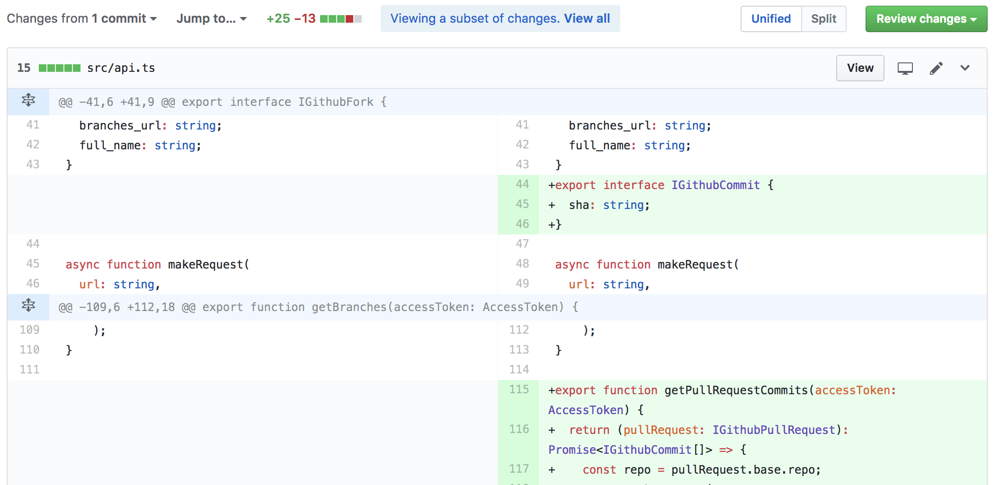

# Stacker
Split your huge pull requests into small, easily understandable pieces

##  Features
### "Files changed" view only shows changes related to this PR

### Dependencies listed on "Pull requests" view

# Workflow

- 1. Create a new pull request
- 2. Select a parent pull request

- 3. Done! After this everyone with the extension can see your pull request as a dependant PR

## Related work

- [Stacked Pull Requests: Keeping GitHub Diffs Small](https://graysonkoonce.com/stacked-pull-requests-keeping-github-diffs-small/)

- [#959 Mark pull request as depending on another](https://github.com/isaacs/github/issues/959)
- [#950 Stacked Pull Requests](https://github.com/isaacs/github/issues/950)

This project was bootstrapped with [Create React App](https://github.com/facebookincubator/create-react-app).