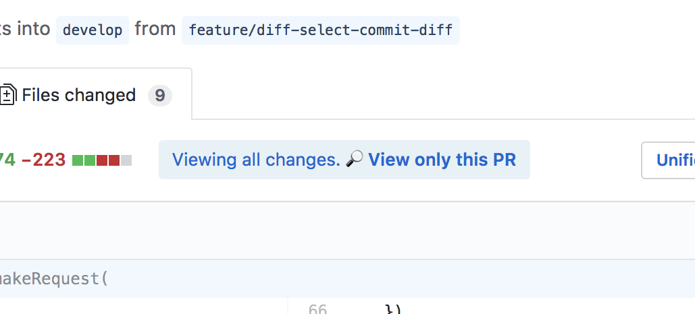
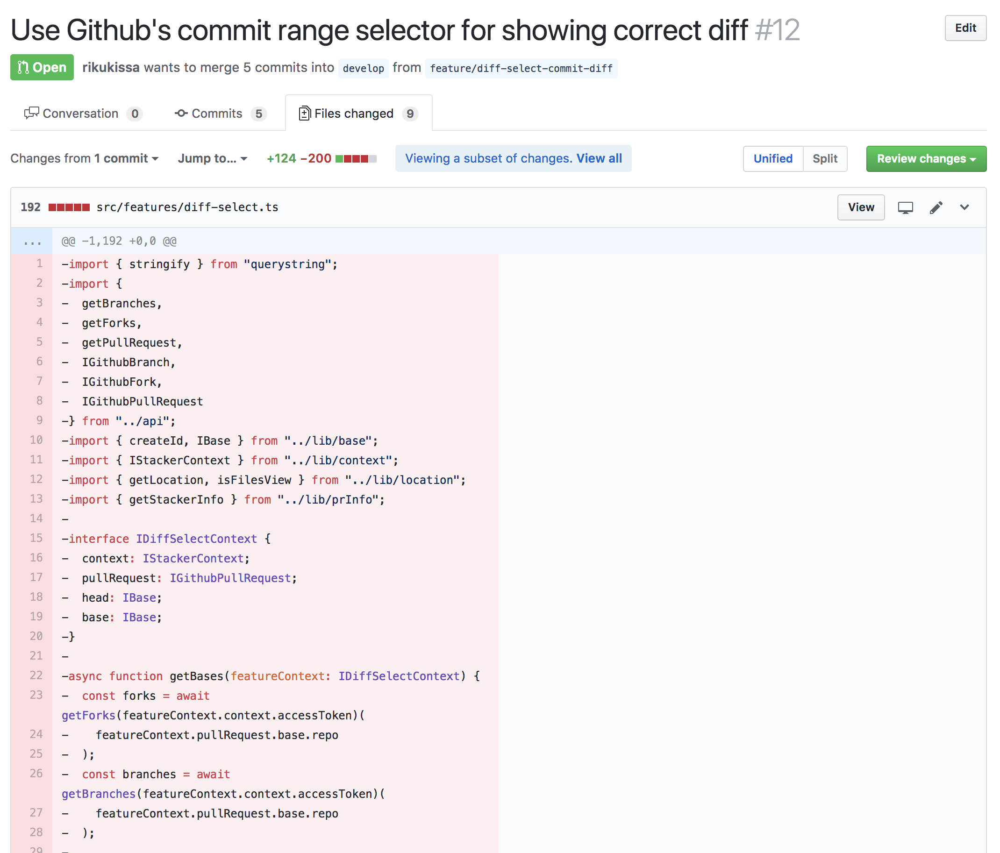

# Stacker
Better workflow for Github pull requests

|||
| ------------- | ------------- |
||
|   |   |

This project was bootstrapped with [Create React App](https://github.com/facebookincubator/create-react-app).