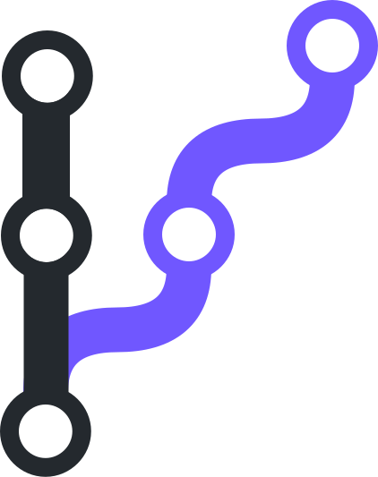
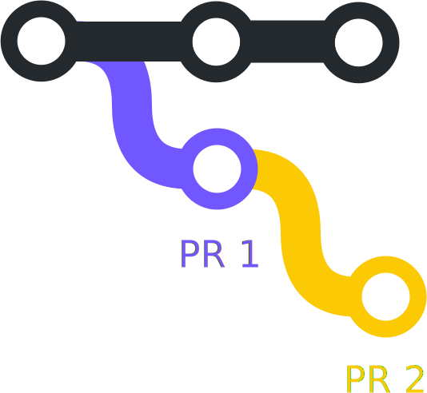
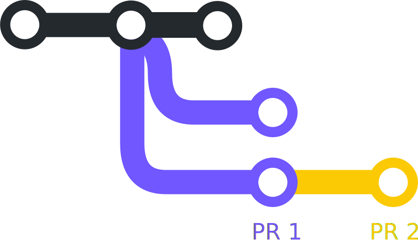
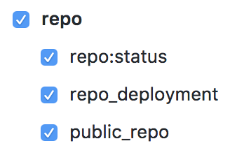
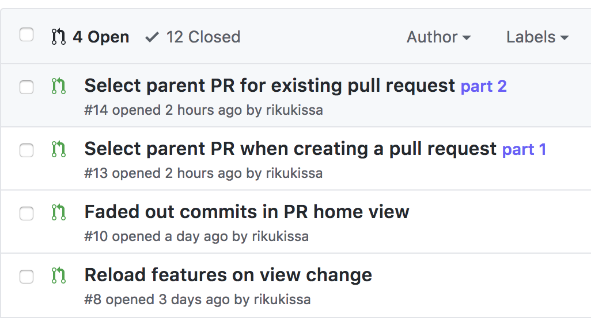
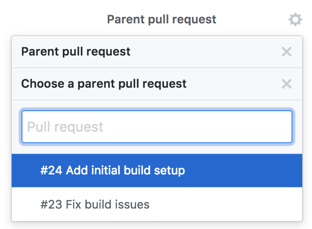
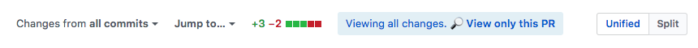
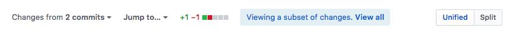
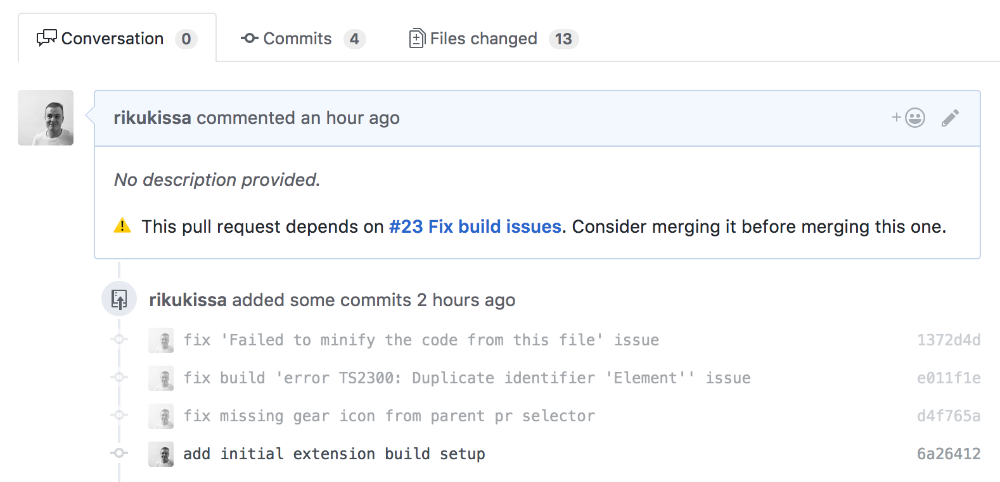

  
  <h1 align="center">Stacker</h1>

Intuitive and automated way for creating and reviewing stacked pull requests on Github  <a href="https://chrome.google.com/webstore/detail/apkgobbdndlnnelabdjdapopocfcgbhf">Download the Chrome extension</a>

Stacker is a Chrome extension that makes working with stacked pull requests easier both for PR authors and reviewers. Github's UI provides a lot of useful features for working with stacked PRs out of the box. However, many of those features require you to follow manual, repeatitive steps, that this extension automates for you.

## So what are stacked pull requests?

TODO

## Stacking options

<table>
  <thead>
  </thead>
    <tr>
      <td width="50%" align="center">
         
         
         
         
        <strong>
          Each PRs' <a href="https://github.com/blog/2224-change-the-base-branch-of-a-pull-request">base</a> set to parent PR's branch
        </strong>
         
         
      </td>
      <td width="50%" align="center">
         
        
         
         
        <strong>
          All PRs based on upstream  (Suggested when using the extension)
        </strong>
         
      </td>
    </tr>
  <tbody>
    <tr>
      <td width="50%">
        <strong>Pros:</strong>
        <ul>
          <li>
            Easier to review
            <ul>
              <li>
                All PR views only shows changes from 
              </li>
            </ul>
          </li>
        </ul>
      </td>
      <td width="50%">
        <strong>Pros:</strong>
        <ul>
          <li>No tinkering with PRs' base</li>
        </ul>
      </td>
    <tr>
    <tr>
      <td width="50%">
        <strong>Cons:</strong>
        <ul>
          <li>
            Feature can only be shipped forward after all child PRs are ready.
            <ul>
              <li>
                 can't be merged to upstream before  is reviewed and merged to .
              </li>
            </ul>
          </li>
          <li>
             can be accidentally merged to a wrong branch
            <ul>
              <li>
                If  still gets merged before, failing to update 's
                base before merging will lead into it being merged to a stale branch.
            </li>
            </ul>
          </li>
        </ul>
      </td>
      <td width="50%">
        <strong>Cons:</strong>
        <ul>
          <li>
            "Files changed" view and all the other 's views are now cluttered with changes from .
            <ul>
              <li>
                ✨ Stacker automatically hides all of these
              </li>
            </ul>
          </li>
          <li>
             can get merged accidentally if  is merged first
            <ul>
              <li>
                ✨ Stacker shows a warning in PR's message
              </li>
            </ul>
          </li>
        </ul>
      </td>
    </tr>
  </tbody>
</table>

---

## Installation
**Give it a go:**

1. Download [the extension](https://chrome.google.com/webstore/detail/apkgobbdndlnnelabdjdapopocfcgbhf)

**If you like it and want to keep on using it:**

2. Generate a new personal access token with following permissions:  
3. Open up Stacker options by clicking the extension icon at the right-top corner of your Chrome window. You'll notice that **access token** field for github.com domain is empty. Paste your token there and you're all set!

**For Github Enterprise users:**

4. Add a new domain and access token from Stacker options (step 3).

---

## Features

<h3 align="center">Mark pull request as dependent of your previous work</h3>

| |  |
|--|--|

  When reviewing stacked pull requests, it's important to know in what order the work should be reviewed. Most commonly the proposed solution is to prefix pull request titles with <strong>[PART-2]</strong>, which works fine. Stacker does this automatically for you and uses different colors to make distinction between the different chains of pull requests.

<h3 align="center">View only changes made in this pull request</h3>

||
|--|
||

  By default on the "Files changed" tab, Github shows you all changes from all commits included in your pull request. Oftentimes when working with stacked pull requests this is not what you want. Stacker automatically figures out which commits are actually part of the pull request and redirects you to a diff view with only these changes.

<h3 align="center">Automatic warnings on sequential pull requests</h3>

||
|--|

  Stacker adds a warning to every pull request that has been marked dependent on some other pull request. This is to prevent accidental merging before the parent pull request is merged.

---

## Related work

- [Stacked Pull Requests: Keeping GitHub Diffs Small](https://graysonkoonce.com/stacked-pull-requests-keeping-github-diffs-small/)

- [#959 Mark pull request as depending on another](https://github.com/isaacs/github/issues/959)
- [#950 Stacked Pull Requests](https://github.com/isaacs/github/issues/950)

---

This project was bootstrapped with [Create React App](https://github.com/facebookincubator/create-react-app).

**Thanks for reading 🙂**
