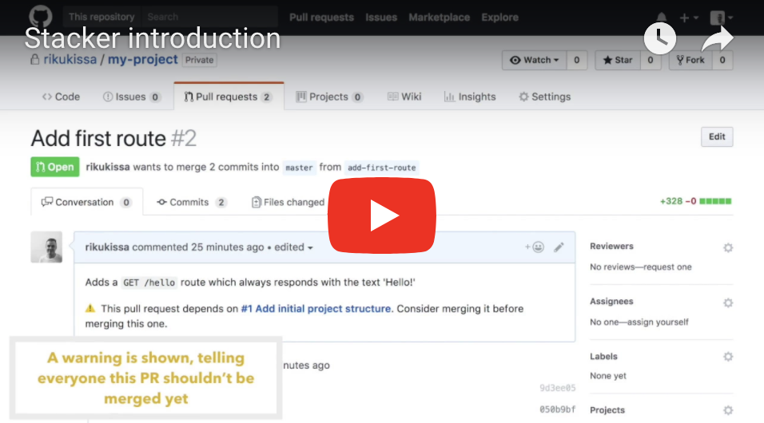
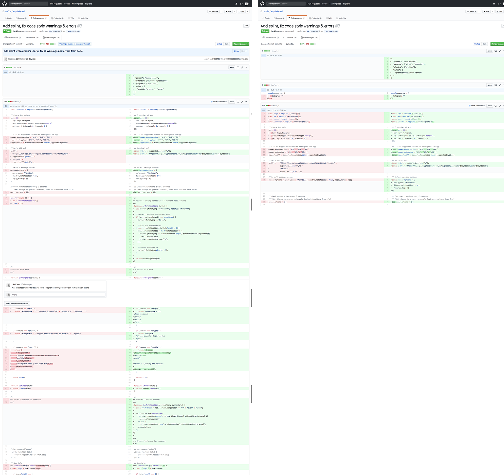

  
  <h1 align="center">Stacker</h1>

The best damn Github Pull Request Stacking Chrome Extension built so far  <a href="https://chrome.google.com/webstore/detail/apkgobbdndlnnelabdjdapopocfcgbhf">Download the Chrome extension</a>  

---

[![Sponsored](https://img.shields.io/badge/chilicorn-sponsored-brightgreen.svg?logo=data%3Aimage%2Fpng%3Bbase64%2CiVBORw0KGgoAAAANSUhEUgAAAA4AAAAPCAMAAADjyg5GAAABqlBMVEUAAAAzmTM3pEn%2FSTGhVSY4ZD43STdOXk5lSGAyhz41iz8xkz2HUCWFFhTFFRUzZDvbIB00Zzoyfj9zlHY0ZzmMfY0ydT0zjj92l3qjeR3dNSkoZp4ykEAzjT8ylUBlgj0yiT0ymECkwKjWqAyjuqcghpUykD%2BUQCKoQyAHb%2BgylkAyl0EynkEzmkA0mUA3mj86oUg7oUo8n0k%2FS%2Bw%2Fo0xBnE5BpU9Br0ZKo1ZLmFZOjEhesGljuzllqW50tH14aS14qm17mX9%2Bx4GAgUCEx02JySqOvpSXvI%2BYvp2orqmpzeGrQh%2Bsr6yssa2ttK6v0bKxMBy01bm4zLu5yry7yb29x77BzMPCxsLEzMXFxsXGx8fI3PLJ08vKysrKy8rL2s3MzczOH8LR0dHW19bX19fZ2dna2trc3Nzd3d3d3t3f39%2FgtZTg4ODi4uLj4%2BPlGxLl5eXm5ubnRzPn5%2Bfo6Ojp6enqfmzq6urr6%2Bvt7e3t7u3uDwvugwbu7u7v6Obv8fDz8%2FP09PT2igP29vb4%2BPj6y376%2Bu%2F7%2Bfv9%2Ff39%2Fv3%2BkAH%2FAwf%2FtwD%2F9wCyh1KfAAAAKXRSTlMABQ4VGykqLjVCTVNgdXuHj5Kaq62vt77ExNPX2%2Bju8vX6%2Bvr7%2FP7%2B%2FiiUMfUAAADTSURBVAjXBcFRTsIwHAfgX%2FtvOyjdYDUsRkFjTIwkPvjiOTyX9%2FAIJt7BF570BopEdHOOstHS%2BX0s439RGwnfuB5gSFOZAgDqjQOBivtGkCc7j%2B2e8XNzefWSu%2BsZUD1QfoTq0y6mZsUSvIkRoGYnHu6Yc63pDCjiSNE2kYLdCUAWVmK4zsxzO%2BQQFxNs5b479NHXopkbWX9U3PAwWAVSY%2FpZf1udQ7rfUpQ1CzurDPpwo16Ff2cMWjuFHX9qCV0Y0Ok4Jvh63IABUNnktl%2B6sgP%2BARIxSrT%2FMhLlAAAAAElFTkSuQmCC)](http://spiceprogram.org/oss-sponsorship)

## TL;DR

Stacker adds features to Github's UI which makes managing stacked pull requests easier.

**Screencast:**

**Features:**
- [✏️ Mark pull request as a dependent of your previous work](#mark-pull-request-as-dependent-of-your-previous-work)
- [🔎 Only see changes made in the PR you’re reviewing](#only-see-changes-made-in-the-pr-youre-reviewing)
- [⚠️ Automatic warnings of pull request dependencies](#automatic-warnings-of-pull-request-dependencies)

---

Reviewing and even creating pull requests on Github can sometimes be very frustrating. Especially when you're reviewing a PR so large that it becomes difficult to follow what is happening. A solution for this is to start thinking of pull requests as smaller increments, for example a feature. Don't get me wrong, they should still be logical increments and not just some random blobs of commits, but the idea remains the same. They should be broken up into smaller pieces.

Stacker is a Chrome extension that makes your life that tiny bit easier 🤠. It's packed with modern Github UI DOM manipulation trickery.

If you already feel like you know what stacked pull requests are, jump right into [installation/features](#installation). If not, read on!

## So what are stacked pull requests?

As you start splitting your pull requests into smaller chunks, you come to notice that one PR's code is actually dependent on anothers, and you continue to work on top of the previous PR you made. This is completely fine, but the question now is whether you want to proceed with the *Upstream based pull request* and keep your second PR's <a href="https://github.com/blog/2224-change-the-base-branch-of-a-pull-request">base</a> as upstream (master/develop, usually the selected by default) or set it to be the branch your previous PR uses (this is what I shall call a *Parent based pull request*).

## Common pull request workflows

<table>
  <thead>
    <tr>
      <td width="50%" align="center">
         
         
         
        

          <strong>
            Parent based pull request
          </strong>
           
          PR's <a href="https://github.com/blog/2224-change-the-base-branch-of-a-pull-request">base</a>
          is set to previous PR's branch
        

      </td>
      <td width="50%" align="center">
         
         
        
         
         
        

          <strong>
            Upstream based pull request
          </strong>
           
          Keeps the base as upstream and shares the commit history with its parent.
        

      </td>
    </tr>
  </thead>
  <tbody>
    <tr>
      <td>
         
        

           is a sequel to .  For instance, in  you implement the tooling and boilerplate for localization and in the second one you add the localization itself.
        

      </td>
      <td>
        

           
          
          depends on the functionality proposed in
          , but the dependency doesn't go the other way. 
          They can be published as 2 separate pieces of functionality.
        

      </td>
    </tr>
  </tbody>
</table>

---

### Parent based pull request

#### Pros

** is easily reviewable once the reviewer understands changes proposed in **

- The entire Github's PR view only shows changes made in .
- Reviewers are able to figure out which PR is a sequel to the PR they just reviewed. Adding **[PART 2]** type labels also makes this more prominent.

#### Cons

**The first PR (parent) can only move forward after all child PRs are reviewed and ready to be merged.**

 can't be merged to upstream before  is reviewed and merged to .

** can accidentally be merged into a stale branch**

- If  gets merged first, failing to update 's
base before merging will lead it to being merged to a stale branch.

 ✨ This is when Stacker helps. It shows you a warning on the parent PR. For this initial release I've decided to just show a warning. Would disabling the merge button altogether be more useful? Create an issue if you have an opinion about this :).

**Well, ok, it's quite bothersome to actually figure out the PR dependency tree**
- ✨ Stacker actually fixes this with fancy labels on the PR titles, but more about that later on.

---
### Upstream based pull request

#### Pros

**Parent PRs can now be merged even when the children aren't ready**

Obviously depends a bit of the PRs you decide to make. As a side note, I really wanna bring up this [great article about Feature Toggles](https://martinfowler.com/articles/feature-toggles.html) and how they can help you deploy your to production even when it's still a bit unpolished. There are also couple of other really inviting benefits this approach offers, but I'll let you read about them yourself.

#### Cons

** includes changes from both PRs making it more difficult to review.**

- ✨ Yup, you guessed it. Totally want to fix this and this was actually the main reason I started writing this extension. In this case the extension changes Github's default "Files changed" - view to show you only changes from the pull request you're reviewing. Sweet!

**There's no easy way of seeing that  is a sequel for **

- ✨ Stacker's colored labels on Github's "Pull requests" - view should help a lot with this. On top of this, each label has a number that helps understanding in which orders the pull requests should be reviewed.

** can get merged accidentally if  is merged first**

- ✨ This is where the warning is shown on the child PR's summary.

---

## Installation

1. Download [the extension](https://chrome.google.com/webstore/detail/apkgobbdndlnnelabdjdapopocfcgbhf)

(+ private repositories):

2. Generate a new [personal access token](https://github.com/settings/tokens) and add the following scopes:

3. Open up Stacker options by clicking the extension icon at the right-top corner of your Chrome window. You'll notice that **access token** field for github.com domain is empty. Paste your token there and you're all set!

(+ self-hosted Github Enterprise)

4. Add a new domain and an access token (same as step 3).

---

## Features

### Mark pull request as dependent of your previous work

| |  |
|--|--|

### Only see changes made in the PR you’re reviewing

||
|--|

### Automatic warnings of pull request dependencies

||
|--|

---

## Related work

- [Stacked Pull Requests: Keeping GitHub Diffs Small](https://graysonkoonce.com/stacked-pull-requests-keeping-github-diffs-small/)

- [#959 Mark pull request as depending on another](https://github.com/isaacs/github/issues/959)
- [#950 Stacked Pull Requests](https://github.com/isaacs/github/issues/950)

---

This project was bootstrapped with [Create React App](https://github.com/facebookincubator/create-react-app).

**Thanks for reading 🙂**
